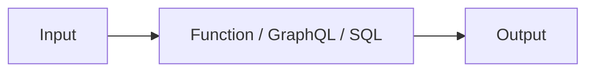
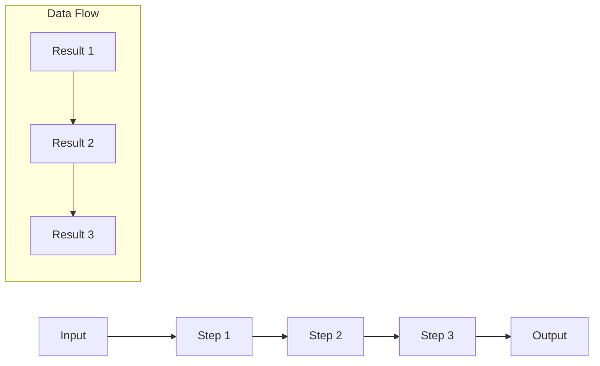
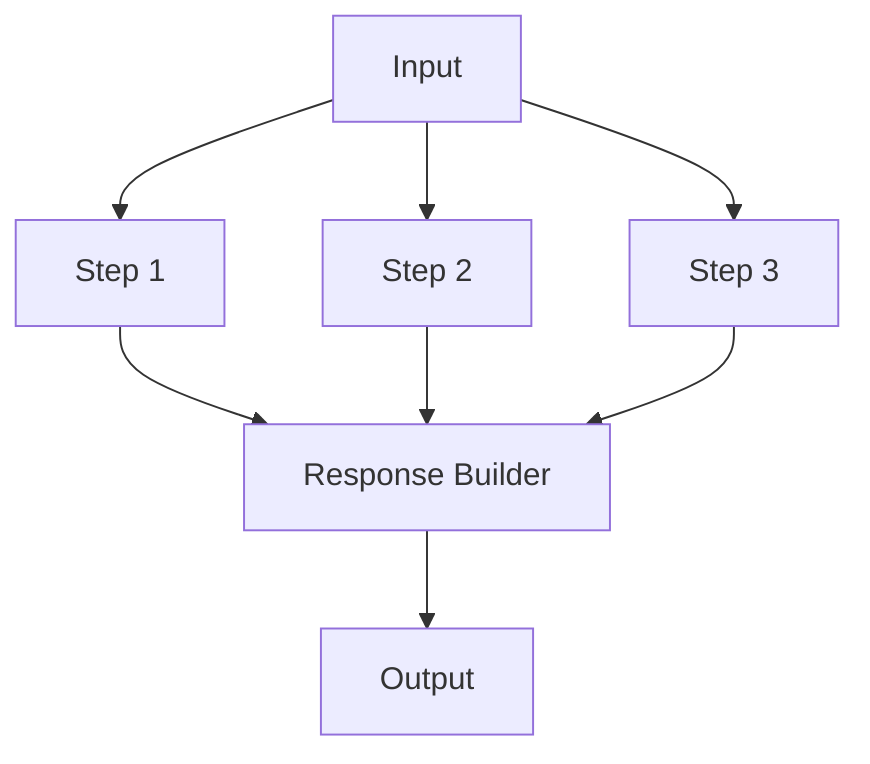

# Tailor SDK

A development kit for building applications on the Tailor Platform.

## Table of Contents
- [Installation](#installation)
- [Getting Started](#getting-started)
- [TailorDB](#tailordb)
  - [Defining Models](#defining-models)
  - [Field Types and Configurations](#field-types-and-configurations)
  - [Relations](#relations)
  - [Timestamps](#timestamps)
  - [Registering Models with a Workspace](#registering-models-with-a-workspace)
  - [API Reference](#tailordb-api-reference)
- [Pipeline Resolvers](#pipeline-resolvers)
  - [Processing Flow Patterns](#processing-flow-patterns)
  - [Resolver Interfaces](#resolver-interfaces)
  - [Registering Resolvers with a Workspace](#registering-resolvers-with-a-workspace)
  - [API Reference](#api-reference)

## Installation

```bash
npm install @tailor-platform/tailor-sdk
# or
yarn add @tailor-platform/tailor-sdk
# or
pnpm add @tailor-platform/tailor-sdk
```

## Getting Started

```typescript
import { Tailor, functionStep, pipeline, sqlStep } from '@tailor-platform/tailor-sdk';

const workspace = Tailor.newWorkspace('my_workspace');

// Define your services, models, and pipelines
// ...

workspace.apply();
```

## TailorDB

TailorDB is a data modeling and persistence layer that allows you to define your application's data models using TypeScript classes with decorators. These definitions are automatically translated to database schemas and GraphQL types.

### Defining Models

Models are defined as TypeScript classes decorated with `@TailorDBType()` and fields are defined with `@TailorDBField()`:

```typescript
import { 
  TailorDBType, 
  TailorDBField, 
  Type, 
  TypeField,
  ArrayOf 
} from '@tailor-platform/tailor-sdk';

@TailorDBType()
class ProductItem {
  @TypeField({type: 'uuid'})
  id!: string;
  
  @TailorDBField({required: true, index: true, unique: true})
  name!: string;
}

@TailorDBType({withTimestamps: true})
class Product {
  @TypeField({type: 'uuid'})
  id?: string;

  @TailorDBField({required: true, index: true, unique: true})
  name!: string;

  @TailorDBField()
  description?: string;

  @TailorDBField({type: "integer", required: true})
  price!: number;

  @TailorDBField({type: "float"}) 
  weight?: number;

  @TailorDBField() @ArrayOf(ProductItem)
  items!: ProductItem[];
}
```

> **Supplementary Note**: ID fields are automatically generated, so you don't need to define them explicitly. However, when you need to use an ID in the Type SDL, you can add it using `@TypeField({type: 'uuid'})`.

### Field Types and Configurations

TailorDB supports the following field types:

| TypeScript Type | TailorDB Type | GraphQL Type |
|----------------|--------------|-------------|
| string         | string       | String      |
| number         | integer      | Int         |
| number         | float        | Float       |
| boolean        | bool         | Boolean     |
| string         | uuid         | ID          |
| Date           | datetime     | String      |

You can configure fields with various options:

```typescript
@TailorDBField({
  // Basic configurations
  type: "string",              // Field type (optional, inferred from TypeScript type)
  required: true,              // Whether the field is required
  description: "Description",  // Field description
  
  // Indexing and constraints
  index: true,                 // Whether to create an index for this field
  unique: true,                // Whether the field must have unique values
  
  // Array and relations
  array: true,                 // Whether the field is an array
  foreignKey: true,            // Whether the field is a foreign key
  
  // Validation
  validate: [validateFunction], // Array of validation functions
  allowedValues: [             // For enum-like fields, list of allowed values
    { name: "Active", value: "ACTIVE" },
    { name: "Inactive", value: "INACTIVE" },
  ],
})
```

### Relations

Relations between models are defined using the `@ArrayOf` decorator:

```typescript
@TailorDBField() @ArrayOf(ProductItem)
items!: ProductItem[];
```

This creates a one-to-many relationship between `Product` and `ProductItem`.

### Timestamps

You can automatically add `createdAt` and `updatedAt` fields to your model:

```typescript
@TailorDBType({withTimestamps: true})
class Product {
  // Fields...
}
```

This will:
- Add a `createdAt` datetime field that is automatically set when a record is created
- Add an `updatedAt` datetime field that is automatically updated when a record is modified

### Registering Models with a Workspace

After defining your TailorDB models, you need to register them with a TailorDB service in your workspace:

```typescript
import { Tailor } from '@tailor-platform/tailor-sdk';
import { Product, ProductItem } from './models';

// Create a new workspace
const workspace = Tailor.newWorkspace('my_workspace');

// Create a TailorDB service
const tailorDB = workspace.newTailorDBservice('my_db');

// Register your models with the TailorDB service
tailorDB.addTailorDBType(Product);
tailorDB.addTailorDBType(ProductItem);

// Or register multiple models at once
// tailorDB.addTailorDBType(Product, ProductItem);

// Apply the workspace configuration to create/update resources
workspace.apply();
```

This process:
- Creates a TailorDB service named 'my_db' in your workspace
- Registers your model classes with the service
- When `workspace.apply()` is called, generates the necessary database schemas and GraphQL types

### TailorDB API Reference

#### `TailorDBType(config?: TailorDBTypeConfig)`

Creates a new TailorDB model type.

**Parameters:**
- `config.withTimestamps`: Boolean indicating whether to add `createdAt` and `updatedAt` fields

#### `TailorDBField(config?: TailorDBFieldMetadata)`

Defines a field on a TailorDB model.

**Parameters:**
- `config.type`: Type of the field ('string', 'integer', 'float', 'bool', 'uuid', 'datetime')
- `config.required`: Whether the field is required
- `config.index`: Whether to create an index for this field
- `config.unique`: Whether the field must have unique values
- `config.array`: Whether the field is an array
- `config.foreignKey`: Whether the field is a foreign key
- `config.validate`: Array of validation functions
- `config.allowedValues`: List of allowed values for enum-like fields

#### `ArrayOf(type: Class)`

Defines an array relationship to another model.

**Parameters:**
- `type`: The model class for the relationship

## Pipeline Resolvers

Pipeline Resolvers allow you to create processing flows for your application logic. They support multiple patterns for organizing your code based on your specific needs.

### Processing Flow Patterns

#### 1. Single Step Execution

A simple pattern that executes a single step to process input and return output.



**Example(Function):**

```typescript
import { resolver, functionStep } from '@tailor-platform/tailor-sdk';

// define input/output types ....


// input HelloWorldInput {
//   .....
// }
// type HelloWorldOutput {
//   .....
// }
// extends Mutation {
//   helloWorld(input: HelloWorldInput): HelloWorldOutput
// }
function helloWorld(input: HelloWorldInput): HelloWorldOutput {
  return { message: `Hello, ${input.name}!` };
}

const hello = resolver("helloWorld", functionStep("hello", helloWorld));
```

**Example(SQL):**

```typescript
import { resolver, sqlStep } from '@tailor-platform/tailor-sdk';

@InputType()
export class OrderViewInput {
  @InputTypeField({nullable: true})
  public create_date?: string;
}

@Type()
export class OrderViewOutput {
  @TypeField() ArrayOf(Order)
  orders?: [Order];
}

// input OrderViewInput {
//   create_date: String
// }
// type OrderViewOutput {
//    orders: [Order]
// }
// extends Query {
//   orders_view(input: OrderViewInput): OrderViewOutput
// }
const hello = queryResolver("orders_view", 
    sqlStep<OrderViewInput,OrderViewOutput>("hello", "SELECT id, name FROM Order create_date = :create_date"));
```

#### 2. Sequential Processing (Chain Pattern)

Each step passes its result as input to the next step, creating a processing chain.



**Example:**

```typescript
import { resolver, steps, functionStep } from '@tailor-platform/tailor-sdk';

// define input/output types ....

const createSo = resolver("createSo", 
  steps<CreateSOInput, CreateSOOutput>(
    functionStep("auth", checkAuth),
    functionStep("createHistory", createHistory),
    functionStep("processSo", processSo),
    functionStep("makeResponse", makeResponse),
  )
);
```

#### 3. Parallel Processing with Final Response

Execute multiple steps in parallel and then combine their results in a final step.



**Example:**

```typescript
import { resolver, steps, functionStep } from '@tailor-platform/tailor-sdk';

// define input/output types ....

const orderProcessing = resolver("processOrder", 
  steps< OrderInput, OrderOutput>(
    functionStep("validateOrder", validateOrder),
    [
      functionStep("processPayment", processPayment),
      functionStep("updateInventory", updateInventory),
      functionStep("createShippingLabel", createShippingLabel)
    ],
    functionStep("buildResponse", buildResponse)
  )
);
```

### Registering Resolvers with a Workspace

After defining your Pipeline resolvers, you need to register them with your workspace, similar to how TailorDB types are registered:

```typescript
import { Tailor } from '@tailor-platform/tailor-sdk';
import { helloWorld, processOrder } from './resolvers';

// Create a new workspace
const workspace = Tailor.newWorkspace('my_workspace');

// Register your resolvers with the workspace
const pipelineService = workspace.newPipelineService('my_pipeline');

// Register individual resolvers
pipelineService.addResolver(helloWorld);
pipelineService.addResolver(processOrder);

// Or register multiple resolvers at once
// pipelineService.addResolver(helloWorld, processOrder);

// Apply the workspace configuration to create/update resources
workspace.apply();
```

This process:
- Creates a Pipeline service named 'my_pipeline' in your workspace
- Registers your resolver functions with the service
- When `workspace.apply()` is called, generates the necessary GraphQL schema and resolver implementations

### Resolver Interfaces

Pipeline Resolvers use TypeScript classes with decorators to define their input and output interfaces. These TypeScript definitions are automatically translated to GraphQL schema types.

#### Defining Input and Output Types

```typescript
import { InputType, InputTypeField, Type, TypeField } from '@tailor-platform/tailor-sdk';

@InputType()
export class HelloWorldInput {
  @InputTypeField()
  public name?: string;
}

@Type()
export class HelloWorldOutput {
  @TypeField()
  message?: string;
}
```

> **Note**: You can also use TailorDB types in your Resolvers. This allows you to seamlessly integrate your data models with your Pipeline Resolvers without duplicating type definitions.

#### Generated GraphQL Schema

The above TypeScript definitions generate the following GraphQL schema types:

```graphql
input HelloWorldInput {
  name: String
}

type HelloWorldOutput {
  message: String
}
```

Additionally, for each resolver, a corresponding mutation is automatically generated:

```graphql
extend type Mutation {
  helloWorld(input: HelloWorldInput): HelloWorldOutput
}
```

#### Complete Resolver Example

```typescript
import { resolver, functionStep, InputType, InputTypeField, Type, TypeField } from '@tailor-platform/tailor-sdk';

@InputType()
export class HelloWorldInput {
  @InputTypeField()
  public name?: string;
}

@Type()
export class HelloWorldOutput {
  @TypeField()
  message?: string;
}

function processHello(input: HelloWorldInput): HelloWorldOutput {
  return { 
    message: `Hello, ${input.name || 'World'}!` 
  };
}

export const helloWorld = resolver(
  "helloWorld",
  functionStep("process", processHello)
);
```

npx rollup -c ./packages/tailor-sdk/rollup.config.mjs                                   

### API Reference

#### `resolver(name: string, steps: StepConfig | StepConfig[])`

Creates a new resolver with the given name and step configuration.

#### `functionStep(name: string, function: Function)`

Creates a function step for use in a resolver.

#### `sqlStep(config: SQLStepConfig)`

Creates an SQL step for use in a resolver.

## TailorDB

// TailorDB documentation here